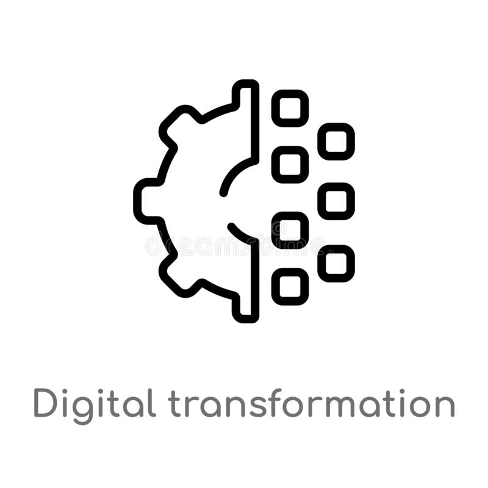

<div id="top"></div>


<!-- PROJECT SHIELDS -->

[![LinkedIn][linkedin-shield]][linkedin-url]


<!-- PROJECT LOGO -->
<br />
<div align="center">
  <a href="https://github.com/othneildrew/Best-README-Template">
    
  </a>

  <h3 align="center">A reference Digital Transformation Architecture</h3>

  <p align="center">
    This is a Digital Transformation Reference Architecture, combining best of breed opensource software. This is not meant to be used for production, does not have any proprietory or copyrightable material. Most of the work is derived from freely available material and best practices learnt over the years.
    <br />
    <a href="#"><strong>Explore the docs »</strong></a>
    <br />
    <br />
    <a href="https://github.com/ranjanprj/DxArchitecture">View Demo</a>
    ·
    <a href="https://github.com/ranjanprj/DxArchitecture/issues">Report Bug</a>
    ·
    <a href="https://github.com/ranjanprj/DxArchitecture/issues">Request Feature</a>
  </p>
</div>


<!-- TABLE OF CONTENTS -->
<details>
  <summary>Table of Contents</summary>
  <ol>
    <li>
      <a href="#about-the-project">About The Project</a>
      <ul>
        <li><a href="#built-with">Built With</a></li>
      </ul>
    </li>
    <li>
      <a href="#getting-started">Getting Started</a>
      <ul>
        <li><a href="#prerequisites">Prerequisites</a></li>
        <li><a href="#installation">Installation</a></li>
      </ul>
    </li>
    <li><a href="#usage">Usage</a></li>
    <li><a href="#roadmap">Roadmap</a></li>
    <li><a href="#contributing">Contributing</a></li>
    <li><a href="#license">License</a></li>
    <li><a href="#contact">Contact</a></li>
    <li><a href="#acknowledgments">Acknowledgments</a></li>
  </ol>
</details>


<!-- ABOUT THE PROJECT -->
## About The Project

[![Product Name Screen Shot][product-screenshot]](https://github.com/ranjanprj/DxArchitecture/)

📢 Open-Source reference Digital Transformation Architecture(Opinionated, Coming Soon)

I always wanted a reference Architecture for Digital Transformation in Enterprises, which I can refer to again and again in times of need and also improve upon.

Not able to find a suitable one I decided to build my own and Open-Source( Coming Soon) it for larger community.

I'm trying to build it with following point with predominant tech stack in mind.


<p align="right">(<a href="#top">back to top</a>)</p>


### Built With

This section should list any major frameworks/libraries used to bootstrap your project. Leave any add-ons/plugins for the acknowledgements section. Here are a few examples.

* [Kubernetes](https://github.com/ranjanprj/DxArchitecture)
* [Spring Boot](https://github.com/ranjanprj/DxArchitecture)
* [Apache Kafka + ActiveMQ](https://github.com/ranjanprj/DxArchitecture)
* [API Gateway (Internal+External)( TBD )](https://github.com/ranjanprj/DxArchitecture)
* [OpenAPI 3.0 and Actuator Services](https://github.com/ranjanprj/DxArchitecture)
* [Data Lake ( TBD )](https://github.com/ranjanprj/DxArchitecture)
* [Business Intelligence (TBD )](https://github.com/ranjanprj/DxArchitecture)
* [IoT Middleware (TBD)](https://github.com/ranjanprj/DxArchitecture)
* [LinkerD Service Mesh](https://github.com/ranjanprj/DxArchitecture)
* [Ingress-nginx](https://github.com/ranjanprj/DxArchitecture)
* [Keycloak - SSO/OAuth](https://github.com/ranjanprj/DxArchitecture)
* [Jenkins for DevSecOps](https://github.com/ranjanprj/DxArchitecture)
* [Terraform/Ansible](https://github.com/ranjanprj/DxArchitecture)
* [AI/ML ( TBD )](https://github.com/ranjanprj/DxArchitecture)


<p align="right">(<a href="#top">back to top</a>)</p>


<!-- GETTING STARTED
## Getting Started

This is an example of how you may give instructions on setting up your project locally.
To get a local copy up and running follow these simple example steps.

### Prerequisites

This is an example of how to list things you need to use the software and how to install them.
* npm
  ```sh
  npm install npm@latest -g
  ```

### Installation

_Below is an example of how you can instruct your audience on installing and setting up your app. This template doesn't rely on any external dependencies or services._

1. Get a free API Key at [https://example.com](https://example.com)
2. Clone the repo
   ```sh
   git clone https://github.com/your_username_/Project-Name.git
   ```
3. Install NPM packages
   ```sh
   npm install
   ```
4. Enter your API in `config.js`
   ```js
   const API_KEY = 'ENTER YOUR API';
   ```

<p align="right">(<a href="#top">back to top</a>)</p>

 -->

<!-- USAGE EXAMPLES -->
## Usage

Taking an example of Supply Chain Portal, where a companies stakeholders Suppliers, Vendors, Customer can come together.


<!-- _For more examples, please refer to the [Documentation](https://example.com)_ -->

<p align="right">(<a href="#top">back to top</a>)</p>


<!-- ROADMAP -->
## Roadmap

<!-- - [x] Set Kubernetes
- [x] Create a single MicroServices using Spring Boot
- [x] Provision Integrate Kafka
- [ ] Add "components" document to easily copy & paste sections of the readme
- [ ] Multi-language Support
    - [ ] Chinese
    - [ ] Spanish -->

See the [open issues](https://github.com/ranjanprj/DxArchitecture/issues) for a full list of proposed features (and known issues).

<p align="right">(<a href="#top">back to top</a>)</p>


<!-- CONTRIBUTING -->
## Contributing

Contributions are what make the open source community such an amazing place to learn, inspire, and create. Any contributions you make are **greatly appreciated**.

You can simply open an issue with the tag "enhancement".
Don't forget to give the project a star! Thanks again!

<p align="right">(<a href="#top">back to top</a>)</p>


<!-- LICENSE -->
## License

Distributed under the Creative Commons License. See `LICENSE.txt` for more information.

<p align="right">(<a href="#top">back to top</a>)</p>


<!-- CONTACT -->
## Contact

Your Name - [@LinkedIn](https://linkedin.com/in/ranjanprj) - ranjanprj@gmail.com

Project Link: [https://github.com/ranjanprj/DxArchitecture](https://github.com/ranjanprj/DxArchitecture)

<p align="right">(<a href="#top">back to top</a>)</p>


<!-- ACKNOWLEDGMENTS -->
## Acknowledgments

This project stands on the shoulders of giants, and I would like to acknowledge all the opensource projects I have used in this project.

<!-- * [Choose an Open Source License](https://choosealicense.com)
* [GitHub Emoji Cheat Sheet](https://www.webpagefx.com/tools/emoji-cheat-sheet)
* [Malven's Flexbox Cheatsheet](https://flexbox.malven.co/)
* [Malven's Grid Cheatsheet](https://grid.malven.co/)
* [Img Shields](https://shields.io)
* [GitHub Pages](https://pages.github.com)
* [Font Awesome](https://fontawesome.com)
* [React Icons](https://react-icons.github.io/react-icons/search) -->

<p align="right">(<a href="#top">back to top</a>)</p>


<!-- MARKDOWN LINKS & IMAGES -->
<!-- https://www.markdownguide.org/basic-syntax/#reference-style-links -->

[linkedin-shield]: https://img.shields.io/badge/-LinkedIn-black.svg?style=for-the-badge&logo=linkedin&colorB=555
[linkedin-url]: https://linkedin.com/in/othneildrew
[product-screenshot]: images/screenshot.png


